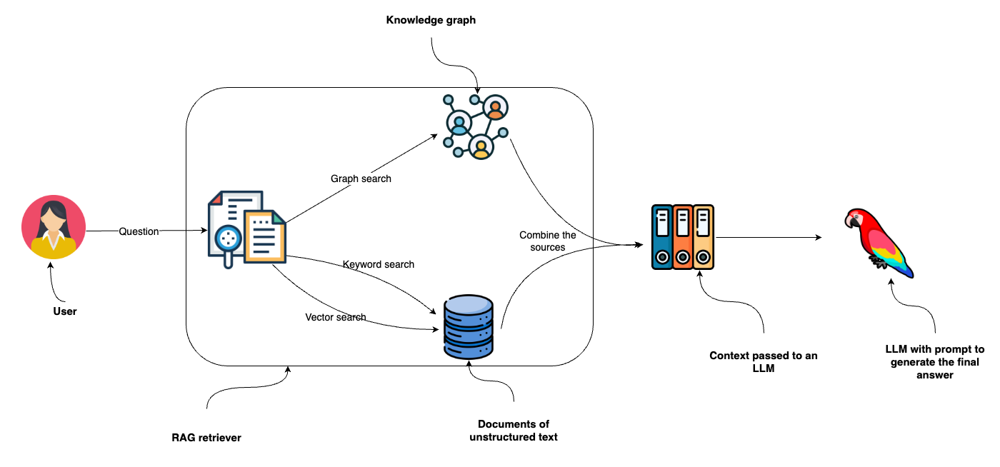

# Enhancing RAG Accuracy with Knowledge Graphs

Graph retrieval augmented generation (Graph RAG) presents a powerful addition to traditional vector search retrieval methods. The idea is to leverage the structured nature of graph databases, which organize data as nodes and relationships, to enhance the depth and contextuality of retrieved information.

Constructing a knowledge graph is typically the most challenging step in leveraging the power of graph-based data representation. However, LLMs, with their profound understanding of language and context, can automate significant parts of the knowledge graph creation process. By analyzing text data, these models can identify entities, understand the relationships between them, and suggest how they might be best represented in a graph structure. This tutorial describes the process of knowledge graph construction and query answering module in two different ways:  
 1) [Llama-Index with Nebula Graph](https://github.com/fatemehsrz/RAG_Knowledge_Graph/blob/main/LlamaIndex_KG_Nebula.ipynb)  
 2) [LangChain with Neo4j](https://github.com/fatemehsrz/RAG_Knowledge_Graph/blob/main/Langchian_KG_Neo4j.ipynb)
 
**Llama-Index and LangChain Comparison:**

|Name|Description|
|---|---|
|`rows` (optional)|The number of rows in the text box shown at a time. In other words, the height of the text box. Behavior is different if `expand` has a value of `1`; see the `expand` parameter below for details. Default: 3|
|`max` (optional)|The maximum number of characters that can be entered into the text box. If this parameter has no value, then there is no limit. This is helpful if you would like to make sure enumerators/enumerators do not enter too much information. It will also have a countdown showing the number of characters remaining.|
|`count` (optional)|Whether or not to show the character count so far. The character count is hidden by default, but shown by default when `max` is specified. Here is a breakdown of the behavior of `count`:<ul><li>**`max` has a numeric value, and `count` is not specified**: The field will show the number of characters remaining.</li><li>**`max` has a numeric value, and `count` has a value of `0`**: The count will be hidden.</li><li>**`max` has no value, and `count` is not specified**:  The count will be hidden.</li><li>**`max` has no value, and `count` has a value of `1`**: The field will show the number of characters entered so far.</li></ul>|
|`expand` (optional)|
If this parameter has a value of `1`, then the text box will expand to fit the content. This can be helpful if you would like enumerators to be able to easily view all content they have entered at once. This is also the default behavior of fields without field plug-ins.

Also, when `expand` has a value of `1`, instead of the `rows` parameter being used to determine the number of rows that will be shown, it defines the maximum number of rows it will expand to. For example, if `expand` has a value of `1`, and `rows` has a value of `5`, then the text box will expand until it is 5 rows tall, and then the enumerator will have to scroll to view the rest of the content.
|

| Model | Query | Answer|
| --- | --- |
| LlamaIndex | `What is Cybertruck?`| `gggg`|
| Langchain | `What is Cybertruck?`| `gggg`
` |
| LlamaIndex | `Who is Elon Musk?`| `gggg`|
| Langchain | `Who is Elon Musk?`|  `gggg`|
| LlamaIndex | `How powerful is the CyberTruck?`| `gggg`|
| Langchain |`How powerful is the CyberTruck?` | `gggg` |
 

